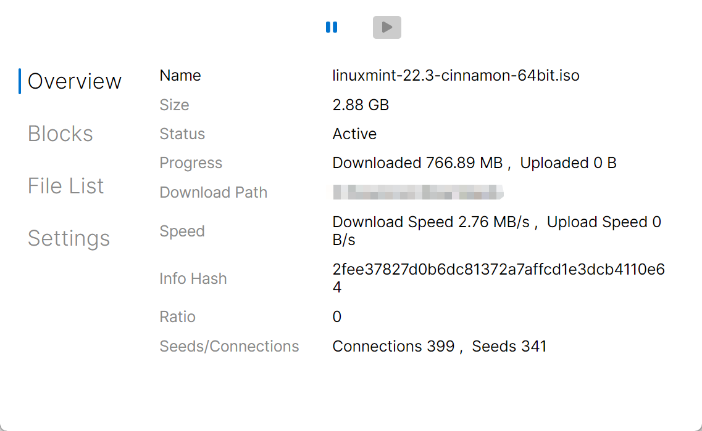
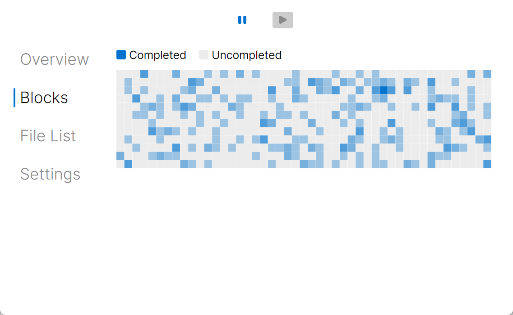
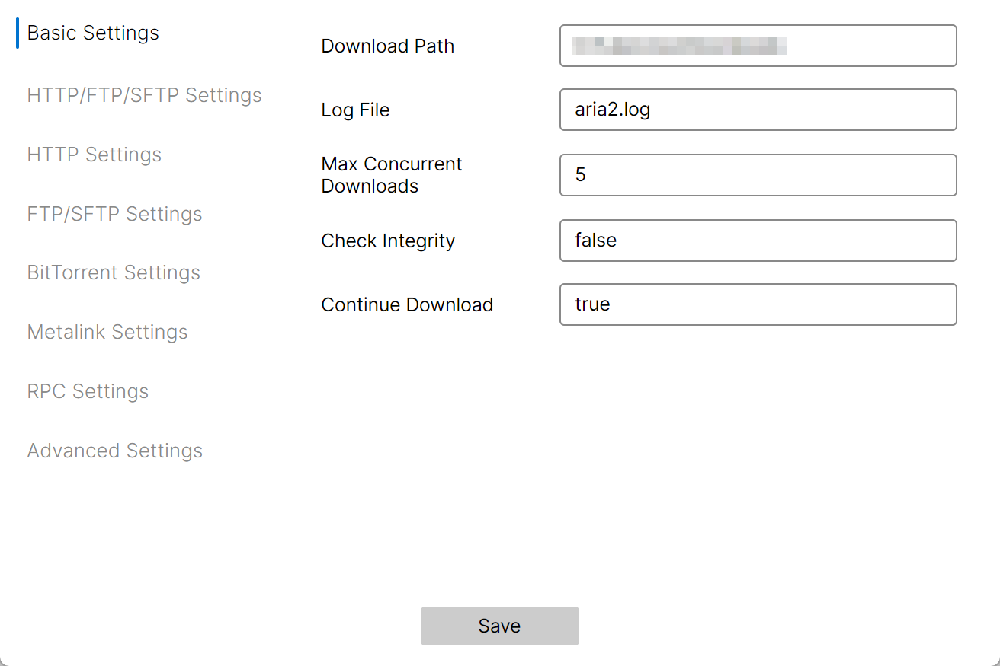
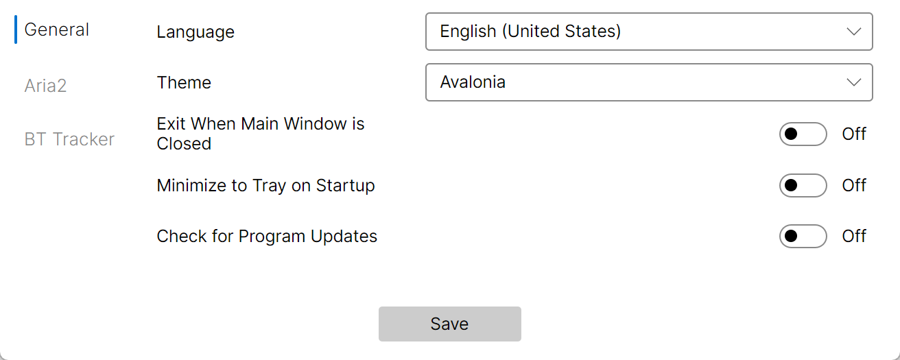
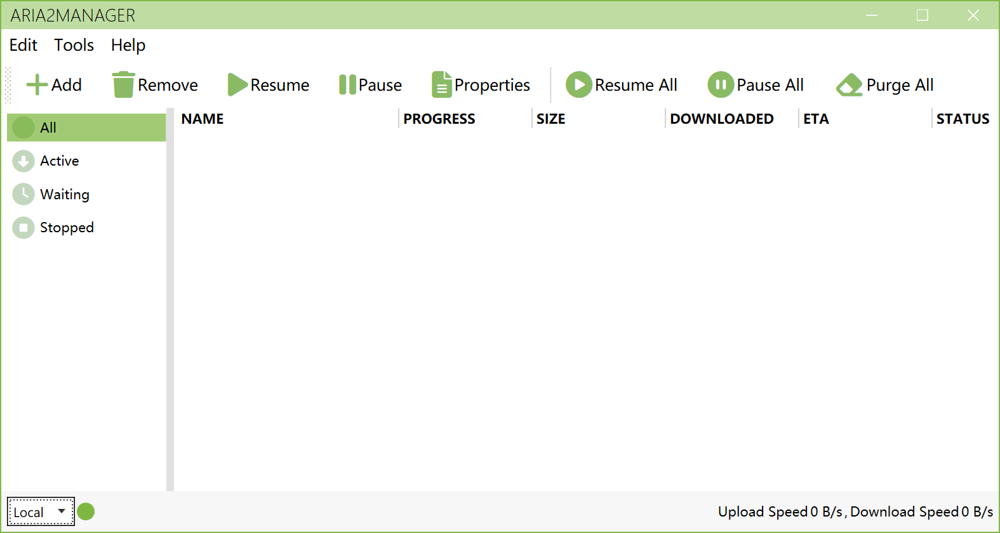
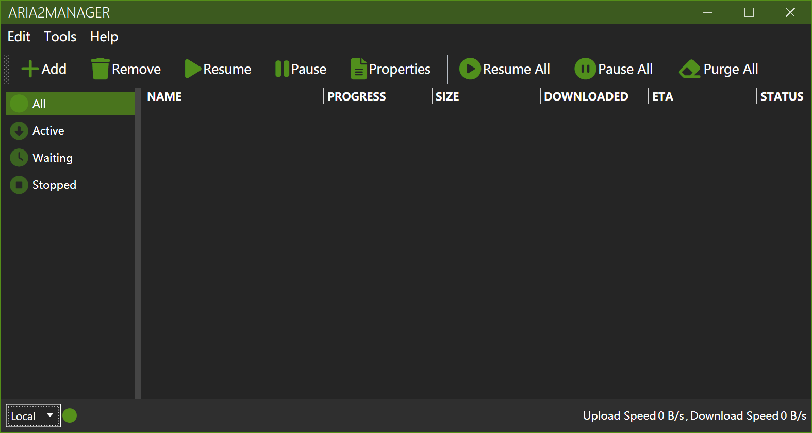

# Aria2Manager

  <a href="https://github.com/Ftbom/Aria2Manager/blob/master/README.md">English</a> | 
  <a href="https://github.com/Ftbom/Aria2Manager/blob/master/README-zh.md"><b>简体中文</b></a>

一款跨平台的 Aria2 桌面管理工具。

---

## 📦 版本与下载指南

本项目目前维护两个 UI 框架分支，请前往 [Releases](https://github.com/Ftbom/Aria2Manager/releases) 页面根据需求下载：

### 1. 选择 UI 分支
* **v2.x (Avalonia 版 - 推荐)**：支持 Windows、Linux 和 macOS，持续更新。
* **v1.x (WPF 版 - 仅维护)**：经典的纯 Windows 分支，目前仅作日常维护与 Bug 修复，不再新增特性。

### 2. 选择软件包类型
* **标准版**（无后缀）：纯粹的 Aria2 RPC 客户端，**不内置 Aria2 程序**。适合已在本地/服务端配置好 Aria2 服务的用户。
* **整合版**（带 `-bundle` 后缀）：**内置官方 Aria2 程序**，解压即用，无需额外配置。
  >*受Aria2官方支持限制，仅提供 Windows x64 版本*

>[!NOTE]
>**Aria2 程序调用次序**：
>1. **系统环境变量**：优先调用系统安装的 Aria2（需通过 `apt` / `brew` 等安装并已加入 PATH 环境）。
>2. **本地子目录**：若系统未安装，将尝试调用软件同级 `Aria2` 文件夹下的可执行程序（可自行下载并放置于此）。

---

## ✨ 核心特性

* **多服务器支持**：添加并切换多个 Aria2 服务器节点。
* **可视化配置**：通过直观的图形界面修改 Aria2 各项参数。
* **添加下载任务**：支持通过 URL、Torrent 种子文件或 Metalink 文件建立任务。
* **下载任务控制**：控制任务的开始、暂停、恢复与删除。
* **系统通知**：任务状态变更时，推送桌面通知。
* **本地文件集成**：对于本地 Aria2 服务器，支持打开下载目录、清理本地文件及编辑本地Aria2配置文件。
* **辅助功能**：自动更新 BT Trackers 列表，检查软件自身与 Aria2 程序版本更新。

---

## 📸 软件截图

### v2.x 跨平台版 (Avalonia)

  
  

  
<b>✨ 点击展开查看更多截图</b>

   

  

    
    
  

  
  

    
    
  

### v1.x 经典版 (WPF)

  
  

---

## 🙏 鸣谢

本项目的实现引用或借鉴了以下开源项目：

* [Aria2.Net](https://github.com/rogerfar/Aria2.NET) - 核心 RPC 通信底层库
* [Avalonia UI](https://github.com/AvaloniaUI/Avalonia) - 优秀的跨平台 UI 框架
* [MahApps.Metro](https://github.com/MahApps/MahApps.Metro) - WPF 主题
* [AM-Downloader](https://github.com/antikmozib/AM-Downloader) - 主界面设计参考
* [AriaNg](https://github.com/mayswind/AriaNg) - Aria2 功能与逻辑实现参考