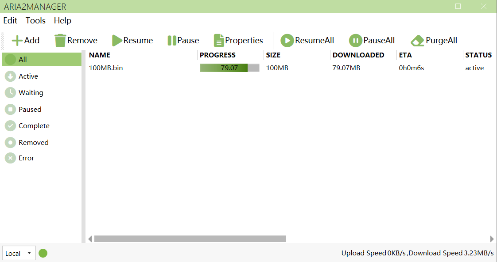

# Aria2Manager

[English](https://github.com/Ftbom/Aria2Manager/blob/master/README.md), [简体中文](https://github.com/Ftbom/Aria2Manager/blob/master/README-zh.md)

Aria2远程管理工具

## 功能

* 添加多个Aria2服务器
* 添加、暂停、继续、删除下载项
* 显示下载项详细信息，可选择要下载的文件
* 添加Url、种子文件或Metalink文件
* 更改Aria2配置项
* 启动时更新bt trackers

## 截图

  

    

      MainWindow  
      
    

    

      MainWindowDark  
      
    

  

  

    

      Aria2Settings
      
    

    

      ProgramSettings
      
    

  

## 致谢

* [Aria2.Net](https://github.com/rogerfar/Aria2.NET) - Aria2 RPC 通信库
* [MahApps/MahApps.Metro](https://github.com/MahApps/MahApps.Metro) - WPF主题
* [AM-Downloader](https://github.com/antikmozib/AM-Downloader) - 主界面设计参考
* [AriaNg](https://github.com/mayswind/AriaNg) - Aria2功能实现参考
