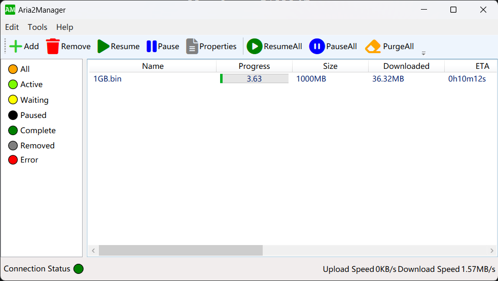
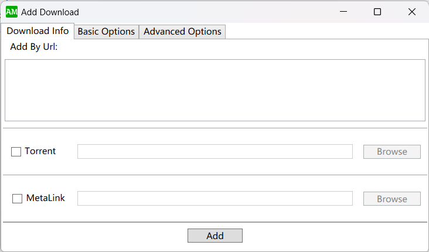
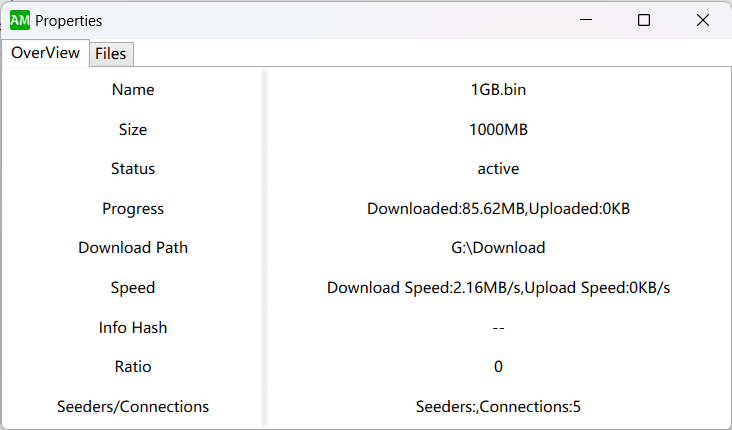
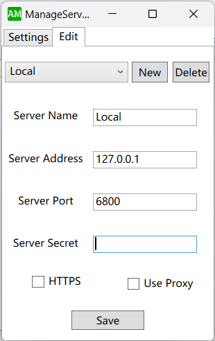
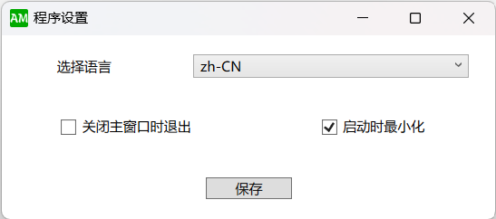
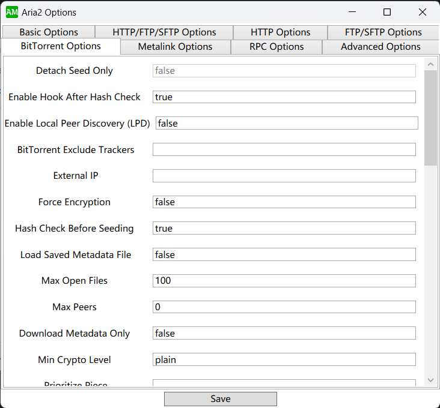

# Aria2Manager

[English](https://github.com/Ftbom/Aria2Manager/blob/master/README.md), [简体中文](https://github.com/Ftbom/Aria2Manager/blob/master/README-zh.md)

Aria2 Remote Manager

## Features

* Add multiple Aria2 servers
* Add, pause, resume, and delete downloads
* View download item details, including the ability to select the files to download
* Add URLs, torrent files, or Metalink files
* Change Aria2 configuration options

## Screenshots

## Thanks

* [Aria2.Net](https://github.com/rogerfar/Aria2.NET) - Aria2 RPC communication library
* [AM-Downloader](https://github.com/antikmozib/AM-Downloader) - Main UI design reference
* [AriaNg](https://github.com/mayswind/AriaNg) - Aria2 feature implementation reference