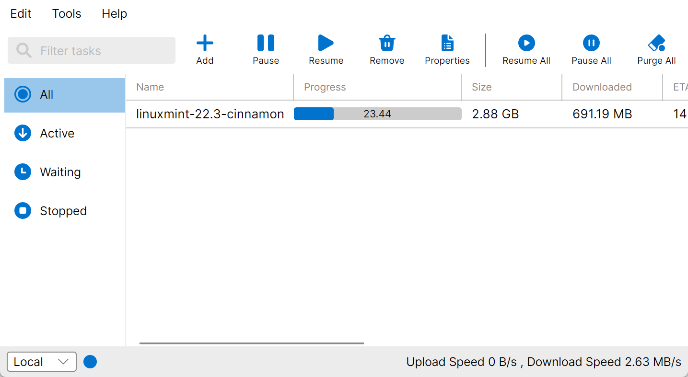
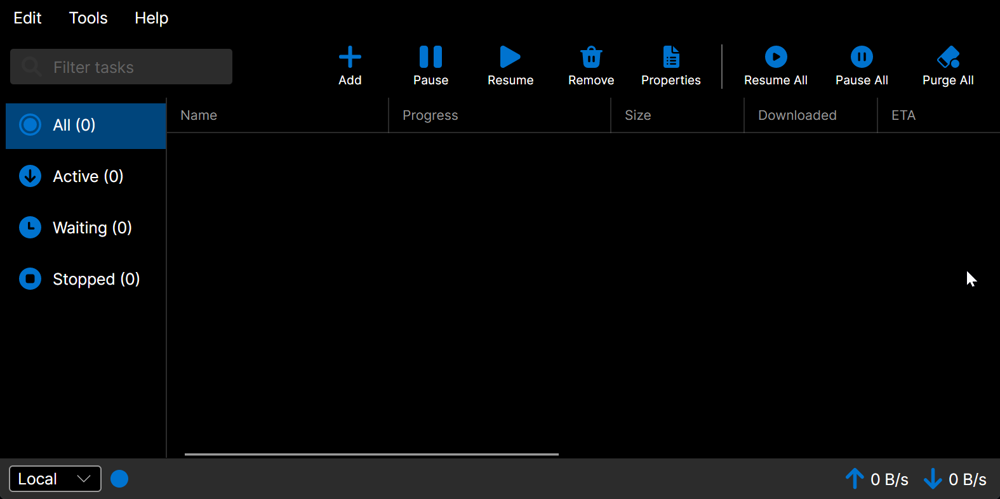

# Aria2Manager

  <a href="https://github.com/Ftbom/Aria2Manager/blob/master/README.md">English</a> | 
  <a href="https://github.com/Ftbom/Aria2Manager/blob/master/README-zh.md">简体中文</a>

A lightweight desktop manager for Aria2 servers

## ✨ Key Features

* [x] **Multi-server Management**: Add and manage multiple Aria2 servers
* [x] **Create Download Tasks**: Add downloads via URL, Torrent files, or Metalink files
* [x] **Task Control**: Manage tasks with start, pause, resume, and delete actions; supports selective file downloading
* [x] **Configuration UI**: Modify Aria2 configuration directly through a graphical interface
* [x] **Local File Management**: Open download directories and delete files locally
* [x] **Real-time Notifications**: Get instant updates for task start, pause, completion, and removal
* [x] **Additional Features**: Auto-update BT trackers, check for Aria2 updates, and application updates
* [ ] **Cross-platform Support**: Currently supports Windows; Linux support (via Avalonia) is planned

## 📸 Screenshots

  
  

## 🙏 Acknowledgements

This project uses or is inspired by the following open-source projects:

* [Aria2.Net](https://github.com/rogerfar/Aria2.NET) - Aria2 RPC communication library
* [MahApps.Metro](https://github.com/MahApps/MahApps.Metro) - WPF UI framework
* [AM-Downloader](https://github.com/antikmozib/AM-Downloader) - Main UI design reference
* [AriaNg](https://github.com/mayswind/AriaNg) - Reference for Aria2 feature implementation