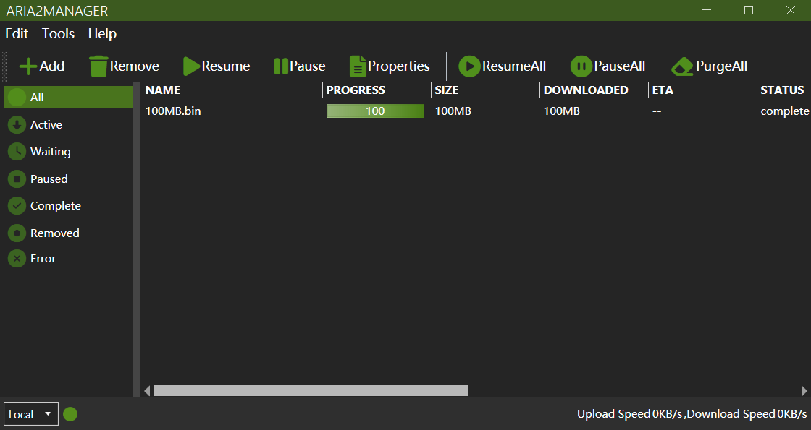

# Aria2Manager

[English](https://github.com/Ftbom/Aria2Manager/blob/master/README.md), [简体中文](https://github.com/Ftbom/Aria2Manager/blob/master/README-zh.md)

Aria2 Remote Manager

## Features

- [x] Add multiple Aria2 servers
- [x] Add, pause, resume, and delete download tasks
- [x] Display detailed information of download tasks, allow selecting files to download
- [x] Add URLs, torrent files, or Metalink files
- [x] Change Aria2 configuration options
- [x] Update BT trackers on startup
- [x] Check for Aria2 updates on startup
- [x] Delete files downloaded by local Aria2 servers
- [x] Show basic information of Aria2 servers in system tray
- [ ] Notify when Aria2 server finishes or fails a download
- [ ] Support WebSocket connection for Aria2 servers

## Screenshots

## Thanks

* [Aria2.Net](https://github.com/rogerfar/Aria2.NET) - Aria2 RPC communication library
* [MahApps/MahApps.Metro](https://github.com/MahApps/MahApps.Metro) - WPF theme
* [AM-Downloader](https://github.com/antikmozib/AM-Downloader) - Main UI design reference
* [AriaNg](https://github.com/mayswind/AriaNg) - Aria2 feature implementation reference
